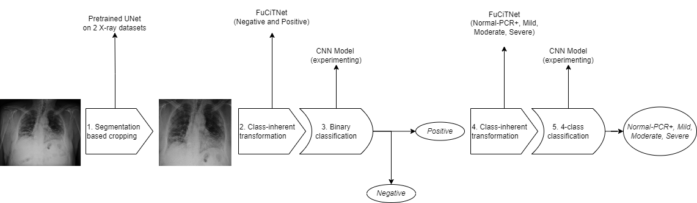

# BetterCOVIDSD-Net: Improving COVID-19 Severity Classification through Chest X-ray



**BetterCOVIDSD-Net: Improving COVID-19 Severity Classification through Chest X-ray**<br>[Vuong Ho](https://github.com/goodudetheboy), [Minh Khoi Nguyen Do](https://github.com/DiningSystem), [Phuc Lam](https://github.com/phcuslamh)<br>

### [Project Page](https://github.com/goodudetheboy/BetterCOVID-SDNet) | [Paper](./paper/paper.pdf) | [Data](#dataset)<br>

Abstract: *As the COVID-19 pandemic is affecting many parts of the world, many studies have also been rapidly conducted to combat this virus in any way possible. One way computer vision plays into this is by developing classification system to detect COVID-19 in patient through chest X-ray. Even though many models have been developed to do a binary classification of whether a patient is contracted or not, few has been created to classify his or her severity level, as thus the accuracy for this task have been low. This project aims to improve upon a previous model COVIDSDNet that achieves this COVID-19 severity level classification task. With an accuracy of 61.80% ± 5.49% in detecting Mild COVID-19 severity level by COVID-SDNet on the COVIDGR-1.0 dataset, there is definitely room of improvement here. We replace the original base Resnet-50 with other 6 CNN base including EfficientNet B1, EfficientNet B7, GoogLeNet, VGG-16, Resnet-101 to observe the changes in per-class accuracy. We found that EfficientNet B1 works best in place of Resnet-50 in terms of runtime and accuracy. Our improved model, called BetterCOVIDSDNet, using EfficientNet B1 as the classifier, achieves an overall accuracy of 71.97%, with 30.24%, 69.18%, 89.74%, and 98.68% for Normal-PCR+, Mild, Moderate, and Severe COVID-19 severity level, compared to the baseline 28.77%, 60.37%, 85.69%, and 98.02%.* 

This project was done as part of Spring 2022 CSC 249 Machine Vision @ the University of Rochester.

# Requirements
The codebase is tested on 
* Python 3.8
* PyTorch 1.7.1

External libraries:
- [pandas](https://pandas.pydata.org/) (fast, powerful, flexible and easy to use open source data analysis and manipulation tool)
- [PyTorch](https://pytorch.org/) (An open source deep learning platform) 
- [scikit-learn](https://scikit-learn.org/) (Machine Learning in Python)

# Table Of Contents
-  [Dataset](#dataset)
-  [Model](#model)
-  [Contributing](#contributing)
-  [Citation](#citation)
-  [License](#license)

# Dataset   
We will be working with COVIDGR-1.0, a lung
X-ray images dataset annotated with COVID-19 severity labels. This dataset came in the same paper by the COVIDSDNet was published from. Since we are improving this
model, it makes sense to use the same dataset. The table below explains the makeup of the COVIDGR-1.0 dataset. The labels
was hand-made by four highly trained radiologists from
Hospital Universitario Cl´ınico San Cecilio, Granada, Spain.
From observing the summary of the dataset, we notice that the X-ray with severity label are somewhat unbalanced. Images labelled Moderate (171 images) are more
than double those labelled Normal-PCR+ (76) and Severe
(79). Also, it was impossible to train on all 5 classes, as we
planned originally, since the Negative labels are much more
than all the other labels. This was the reason we separate
this severity prediction to two stages: binary classification
of Negative and Positive, and 4-class classification of the
severity labels.

| Class       | Severity    | #images       | women | men | 
| ----------- | ----------- | -----------   | ----------- | ----------- |
| Negative    |             | 426 | 190 | 236 |
| COVID-19    | Normal-PCR+ | 76 | | |
| | Mild | 100 | | |
| | Moderate | 171 | | |
| | Severe | 79

## Segmentation based cropping 
We initially tried to fit the uncropped data into the a classification network, but the result was not very good. Taking a look at the dataset, we notice that the X-ray images
themselves contain a lot of unnecessary information, for example, other body parts such as arms, neck, stomach, different X-ray equipments artifacts, and cropping errors which leave a lot
of black spots in the X-ray. As suggested in Tabik et al.
(2020), we decide to crop these X-ray images by first segmenting the lung using a U-Net segmentation model pretrained on Tuberculosis Chest X-ray Image datasets and
RSNA Pneumonia CXR challenge dataset, then finding the
smallest bounding box around the masks, add 2.5% pixels
to each side, then cropping it [4,5,11].

# Model
Our BetterCOVID-SDNet pipeline contains the following stages:
1. Segmentation based cropping
2. Class-inherent transformations network (NvP)
3. Image classification (NvP)
2. Class-inherent transformations network (severity)
3. Image classification (severity)

This pipeline can be seen in the above image.

# Run the demo

Navigate to [src](./src/), install the appropriate libraries, and run the notebook. Everything should be printed out along with metadata of the training.

# Contributing
Any kind of enhancement or contribution is welcomed.

# Citation
```
@unpublished{
    vhmkpl2022,
    title={BetterCOVIDSD-Net: Improving COVID-19 Severity Classification through Chest X-ray},
    author={Vuong Ho and Minh Khoi Nguyen Do and Phuc Lam},
    year={2022},
    url={https://github.com/goodudetheboy/BetterCOVID-SDNet}
}
```

# License
MIT License

Copyright (c) 2022 Vuong Ho, Minh Khoi Nguyen Do, Phuc Lam

Permission is hereby granted, free of charge, to any person obtaining a copy
of this software and associated documentation files (the "Software"), to deal
in the Software without restriction, including without limitation the rights
to use, copy, modify, merge, publish, distribute, sublicense, and/or sell
copies of the Software, and to permit persons to whom the Software is
furnished to do so, subject to the following conditions:

The above copyright notice and this permission notice shall be included in all
copies or substantial portions of the Software.

THE SOFTWARE IS PROVIDED "AS IS", WITHOUT WARRANTY OF ANY KIND, EXPRESS OR
IMPLIED, INCLUDING BUT NOT LIMITED TO THE WARRANTIES OF MERCHANTABILITY,
FITNESS FOR A PARTICULAR PURPOSE AND NONINFRINGEMENT. IN NO EVENT SHALL THE
AUTHORS OR COPYRIGHT HOLDERS BE LIABLE FOR ANY CLAIM, DAMAGES OR OTHER
LIABILITY, WHETHER IN AN ACTION OF CONTRACT, TORT OR OTHERWISE, ARISING FROM,
OUT OF OR IN CONNECTION WITH THE SOFTWARE OR THE USE OR OTHER DEALINGS IN THE
SOFTWARE.